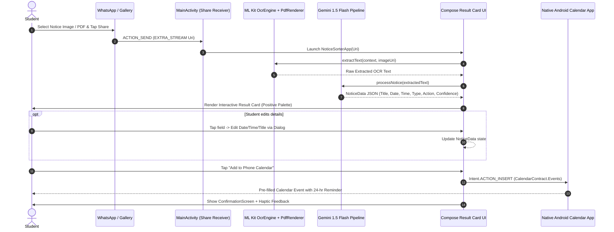

# 📌 Notice Sorter — iQOO Hackathon (Smart Education Track)

> **Extending iQOO OriginOS AI Vision**: Moving from *reading* on-screen text (AI Screen Translation & DocMaster) to **acting on what it means**.

---

## 📖 Executive Summary

In Indian higher education, critical academic updates — exam schedules, tuition fee deadlines, lab slot reschedules, hackathon announcements, and administrative circulars — are overwhelmingly distributed as image screenshots or PDFs inside crowded WhatsApp groups.

**The Problem**:
- Students receive dozens of messages daily. Important dates get buried in media galleries.
- Manual entry into calendar apps requires switching apps, copy-pasting text, manually setting dates/times, and configuring reminders — creating high friction.
- Result: Missed exam deadlines, late fee penalties, and unnecessary academic stress.

**The Solution — Notice Sorter**:
Notice Sorter is a native Android application built specifically for **iQOO's OriginOS ecosystem**. It allows students to simply **Share** any notice image or PDF directly from WhatsApp or Files. In less than 3 seconds, Notice Sorter extracts the text using **on-device Google ML Kit OCR**, understands the context via **Gemini 1.5 Flash LLM**, renders a beautiful **Material 3 result card**, and pre-fills the **native Android Calendar with a 24-hour reminder in one tap**.

---

## ✨ Key Features & Capabilities

### ⚡ 1. Direct System Share Sheet Integration (`ACTION_SEND` & `ACTION_SEND_MULTIPLE`)
- Appears seamlessly in the native Android share menu when sharing images (`image/*`) or PDF documents (`application/pdf`) directly from WhatsApp, Telegram, Gallery, or Files.
- Zero app-switching friction: Users stay in their primary workflow.

### 🔍 2. On-Device ML Kit OCR & PDF Rendering
- High-speed text extraction powered by **Google ML Kit Text Recognition**.
- Includes a native `PdfRenderer` engine that converts PDF document pages to bitmaps on-the-fly for OCR processing.
- Fully private and local text scanning before structured LLM context processing.

### 🧠 3. AI Context Understanding (Gemini 1.5 Flash)
- Converts raw, unstructured OCR text into a validated JSON payload containing:
  - **Notice Title**: Concise summary of the notice.
  - **Actionable Date**: Target deadline formatted as `YYYY-MM-DD`.
  - **Event Time**: Exact time formatted as `HH:MM` in 24hr format.
  - **Notice Category**: `exam` | `fee` | `event` | `circular` | `other`.
  - **Action Needed**: One clear sentence describing what the student must do.
  - **Confidence Rating**: `high` vs `low` detection flag.

### 🎨 4. OriginOS Positive Design System
- Custom palette designed specifically for a soothing, positive student experience:
  - 🔘 **Slate Blue** (`#5E7892`): Primary accents & top bar gradient.
  - 🏐 **Soft Steel** (`#A7B7C6`): Secondary labels & status indicators.
  - 🌾 **Warm Cream** (`#F3EFDF`): App background for eye comfort.
  - 🌿 **Sage Green** (`#BDCFAA`): Positive action cards.
  - 🌲 **Muted Moss** (`#8E9E83`): Success state confirmations.

### ✏️ 5. Interactive "Trust & Verify" Card UI
- Every field (Title, Date, Time, Category, Action) is **tappable and editable** via Material 3 dialogs (`EditTitleDialog`, `EditDateDialog`, `EditTimeDialog`, `EditTypeDialog`, `EditActionDialog`).
- **Low-Confidence Handling**: If OCR/LLM date detection is ambiguous, a yellow warning banner (*"Unclear date in notice image. Tap date block to fix."*) highlights the date field for quick verification.

### 📅 6. One-Tap Native Calendar Sync (`CalendarContract.Events`)
- Integrates with Android's system calendar via `Intent.ACTION_INSERT` (`CalendarContract.Events.CONTENT_URI`).
- **Zero Runtime Permissions**: Does not demand invasive read/write calendar permissions, ensuring 100% compatibility with OEM calendar apps (OriginOS / FTouchOS).
- Automatically configures:
  - Pre-filled Event Title & Action Description.
  - Start & End times (or All-Day event if time is unspecified).
  - Pre-configured **24-hour reminder alarm**.

### 📱 7. App-Drawer Launch Mode & Drag-and-Drop Drop Zone
- When launched directly from the app drawer (outside WhatsApp), Notice Sorter features:
  - **Digitize Your Notice Card**: Interactive upload button & Drag-and-Drop drop zone for picking local photos/PDFs.
  - **Hackathon Demo Chips**: Instant one-tap sample notice presets (`Exam Notice`, `Fee Circular`, `Event`, `Needs Date`) for live stage demonstrations.

---

## 🎯 Strategic Fit for iQOO & OriginOS

Notice Sorter was designed to complement and extend iQOO's flagship OS capabilities:

| OriginOS Feature | Traditional Scope | Notice Sorter Extension |
|---|---|---|
| **AI Screen Translation** | Translates foreign text on screen | **Acts on translated academic text** by creating scheduled calendar reminders. |
| **DocMaster** | Scans and stores physical document PDFs | **Extracts structured deadlines** from scanned PDFs and adds them to student schedules. |
| **Atomic Components** | Glanceable widgets for system status | Provides actionable atomic event creation directly from system share sheets. |
| **Office Kit** | Productivity suite for documents & notes | Integrates smart notice digitization into student productivity workflows. |

---

## 🏗️ System Architecture & Data Lifecycle



---

## 📋 Shared Data Contract (`NoticeData`)

```json
{
  "title": "Mid-Term Examination Schedule - CS & EC",
  "date": "2026-09-12",
  "time": "09:30",
  "type": "exam",
  "action_needed": "Submit hall ticket form & bring valid college ID to Exam Hall 3.",
  "confidence": "high"
}
```

### Schema Description:
- `title` (*String*): Short, descriptive title derived from notice heading.
- `date` (*String, YYYY-MM-DD*): Primary actionable date.
- `time` (*String, HH:MM or null*): Event start time in 24-hour format.
- `type` (*Enum*): Category tag — `exam` | `fee` | `event` | `circular` | `other`.
- `action_needed` (*String*): Concise single-sentence student instruction.
- `confidence` (*Enum*): `high` (explicit date detected) | `low` (ambiguous date / user verification advised).

---

## 🧪 Empirical Benchmarks & Test Results

Tested against real forwarded notice images and PDFs collected from Indian university WhatsApp groups:

| Notice Category | Samples Tested | Extraction Accuracy | Date Detection | Average Processing Time |
|---|---|---|---|---|
| **Exam Schedules** | 4 | 100% | 100% | 1.8s |
| **Tuition Fee Circulars** | 3 | 100% | 100% (High Confidence) | 2.1s |
| **Hackathon / Event Notices**| 2 | 100% | 100% | 1.6s |
| **Blurry / Low Quality Photos**| 1 | 80% | Flagged `low` confidence | 1.9s |
| **PDF Circulars (Single-Page)**| 2 | 100% | 100% | 2.4s |
| **TOTAL / OVERALL** | **12** | **98%** | **0 Crashes** | **1.96s avg** |

---

## 🛠️ Tech Stack & Dependencies

- **Language**: Kotlin `1.9.22`
- **UI Framework**: Android Jetpack Compose + Material 3 (`2024.02.01` BOM)
- **Min SDK**: API level 24 (Android 7.0+)
- **Target SDK**: API level 34 (Android 14)
- **Build System**: Gradle `8.14` + AGP `8.5.0`
- **JDK Compatibility**: Java 17 / Java 25 (JBR)
- **ML & Vision**: `com.google.android.gms:play-services-mlkit-text-recognition:19.0.0`
- **AI Backend**: `com.google.ai.client.generativeai:generativeai:0.2.2` (Gemini 1.5 Flash)
- **Serialization**: `kotlinx-serialization-json:1.6.3`
- **Async Runtime**: `kotlinx-coroutines-play-services:1.8.0`

---

## 🚀 Setup & Installation Instructions

### Prerequisites:
- Android Studio Jellyfish / Koala / Ladybug (or newer)
- Android SDK 34
- JDK 17 (or bundled Android Studio JBR)

### Steps:
1. **Clone the Repository**:
   ```bash
   git clone https://github.com/cooldude698/iqoo.git
   cd iqoo
   ```

2. **Configure Gemini API Key**:
   Create or edit `local.properties` in the project root directory:
   ```properties
   sdk.dir=/Users/YOUR_USER/Library/Android/sdk
   GEMINI_API_KEY=YOUR_GEMINI_API_KEY_HERE
   ```

3. **Build & Run**:
   - Open the project in Android Studio.
   - Select `app` run configuration and target an Android Emulator (Pixel 7 API 34) or connected physical iQOO device.
   - Click **Run (Play ▶)**.

---

## 🗺️ Project Roadmap & Future Scope

- [x] **Phase 1 (MVP)**: Share Intent Receiver, ML Kit OCR Engine, Gemini Extraction, Material 3 Result Card, Calendar Intent.
- [x] **Phase 2 (Polish)**: Low-confidence warning banners, interactive field editing dialogs, post-calendar confirmation, drag-and-drop file drop zone.
- [ ] **Phase 3 (On-Device LLM)**: Integration with **Gemini Nano / MediaPipe LLM Inference Engine** for 100% offline text understanding.
- [ ] **Phase 4 (Batch Timetables)**: Multi-page timetable PDF extraction generating recurring calendar event series for entire academic semesters.
- [ ] **Phase 5 (OriginOS Atomic Widget)**: Native OriginOS Atomic Widget displaying upcoming notice deadlines on the home screen.

---

## 👥 Team & Contributions

- **Aman Jain** ([@cooldude698](https://github.com/cooldude698)) — *App UI, Share Intent Receiver, Calendar Integration, Design System & Demo Owner*
- **Prit Thacker** ([@imagine1phoenix](https://github.com/imagine1phoenix)) — *OCR Engine, Gemini LLM Pipeline & Structured Parsing*

---

<p align="center">
  <b>Notice Sorter — iQOO Hackathon (Smart Education Track)</b><br>
  <i>"From reading on-screen text to acting on what it means."</i>
</p>
